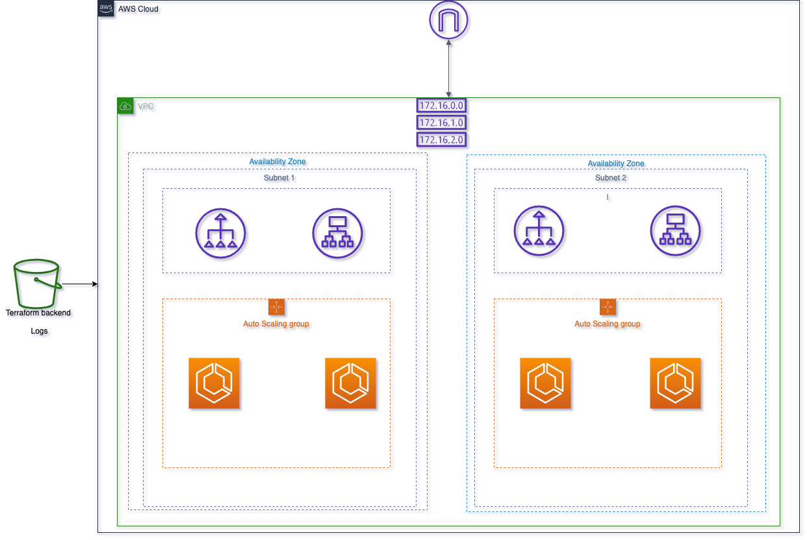

# tf_aws_apache_hello_operator

Terraform module that spawns apache hello cluster on an autoscalabling group of ECS Cluster

Features:
* High-availability (Multi-AZ)
* Loadbalanced (ALB)
* Isolated in a VPC
* Private -> Public access (NAT'd)
* Auto-scaling

## What is ECS

ECS stands for Elastic Container Service and is the AWS platform for running Docker containers.
The full documentation about ECS can be found [here](https://aws.amazon.com/ecs/), the development guide can be found [here](http://docs.aws.amazon.com/AmazonECS/latest/developerguide/Welcome.html). A more fun read can be found at [The Hitchhiker's Guide to AWS ECS and Docker](http://start.jcolemorrison.com/the-hitchhikers-guide-to-aws-ecs-and-docker/).

To understand ECS it is good to state the obvious differences against the competitors like [Kubernetes](https://kubernetes.io/) or [DC/OS Mesos](https://docs.mesosphere.com/). The major differences are that ECS can not be run on-prem and that it lacks advanced features. These two differences can either been seen as weakness or as strengths.

## ECS infra

As stated above, ECS needs EC2 instances that are used to run Docker containers on. To do so you need infrastructure for this. Here is an ECS production-ready infrastructure diagram deployed using this module.

  
## Variables:

### Required Variables

- vpc_id
- subnet
- hello_subnet_ids
- s3_bucket_name_alb_logs
- cluster_name
- hello_agent_task_name
- hello_task_name

### Optional Variables

- ami_id
- ecs_desired_capacity      -- Defauts to 1, when not set
- ecs_max_size              -- Defauts to 1, when not set
- ecs_min_size              -- Defauts to 1, when not set
- ecs_service_desired_count
- asg_adjustment_type
- scaling_adjustment
- health_check_protocol
- service_port
- service_name
- log_retention_in_days
